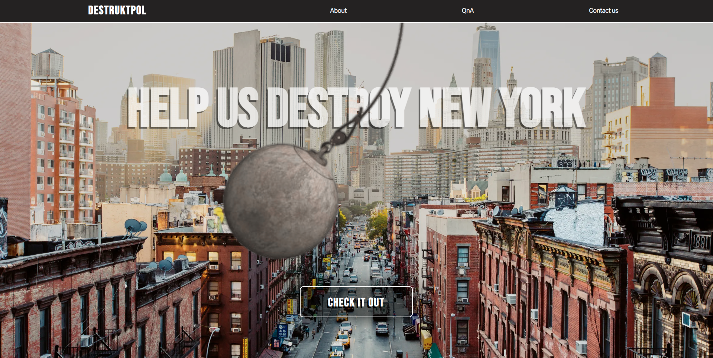
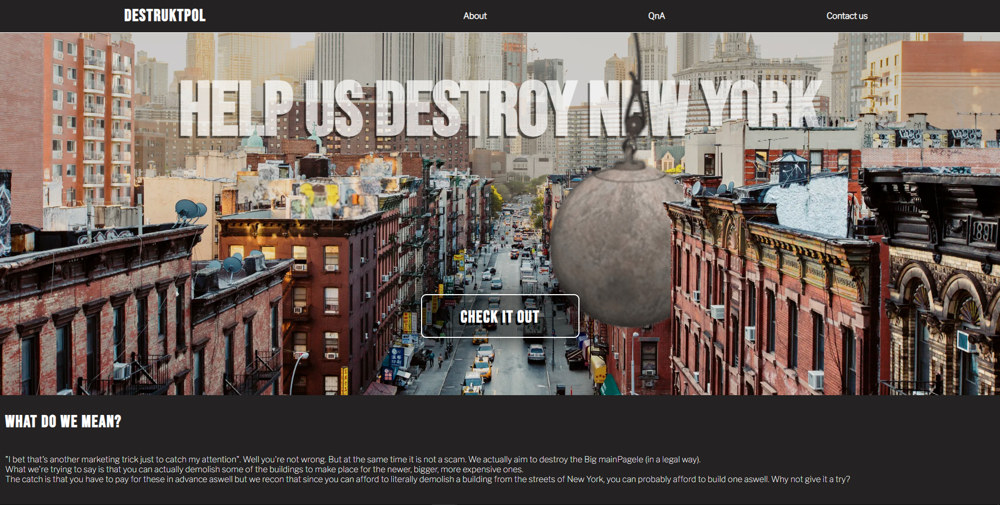
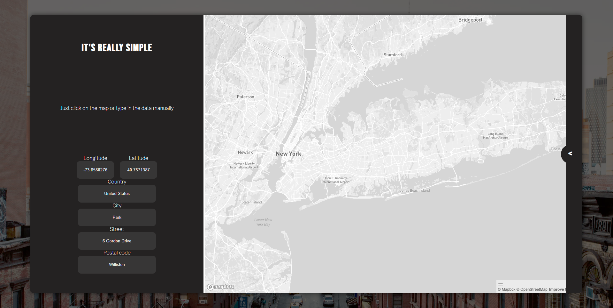

# BHL
Best Hacking League - 8/04/2022

# The main task

We were given a dataset of building and property prices in New York City and had to come up with an Idea of how to use them.
Our goal was to create an App that's purpose is to show you the nearest building worth replacing with another one, serving different purpose in order to profit from it. The team was split into two groups - one responsible for data handling and processing and the other for the app which would make it easy for users to well, use.

## Main page

Main page is supposed to attract attention which it achieves by the neat animation of wrecking ball swinging across the streets of New York and some toungue and cheek images to cover the empty space.

After clicking the _check it out_ button we're getting redirected to the subpage containing the map and therefore, the main functionality of the web app.

## Map

After clicking on the map, the algorithm on the backend will find the best nearby buildings to transform into more profitable ones and nicely line them up in the component on the left side.

### Disclaimer

The app is far behind being finished but we've only had 24 hours and for some of us it was the first hackathon ever, therefore we've decided to leave it as it is. Great experience though.
